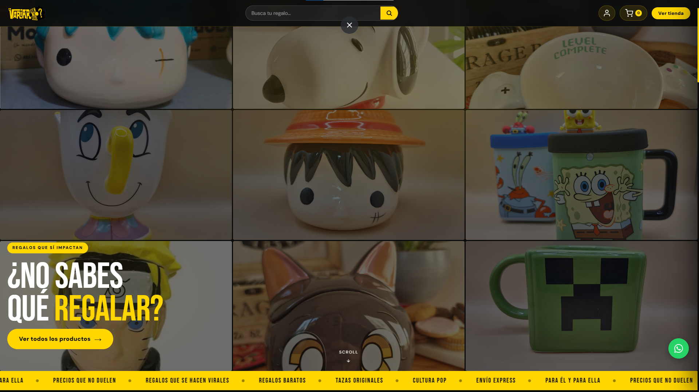
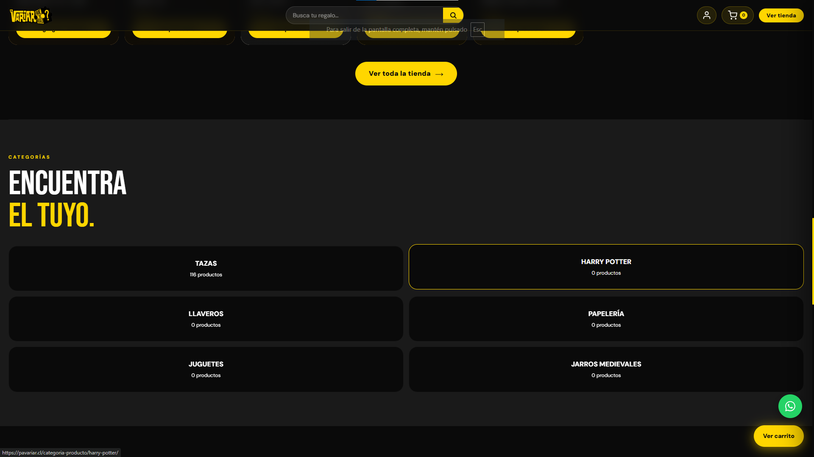
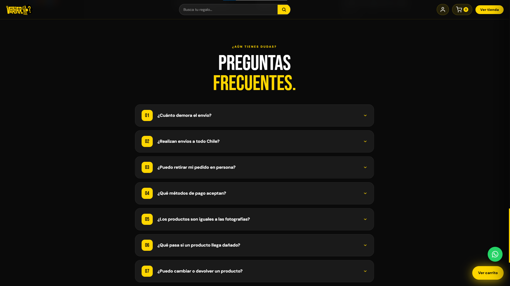
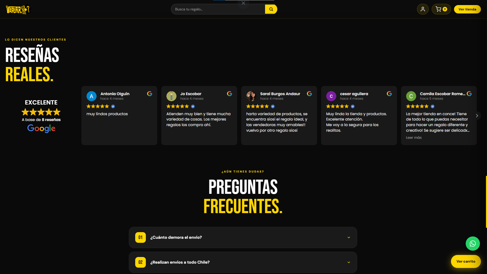
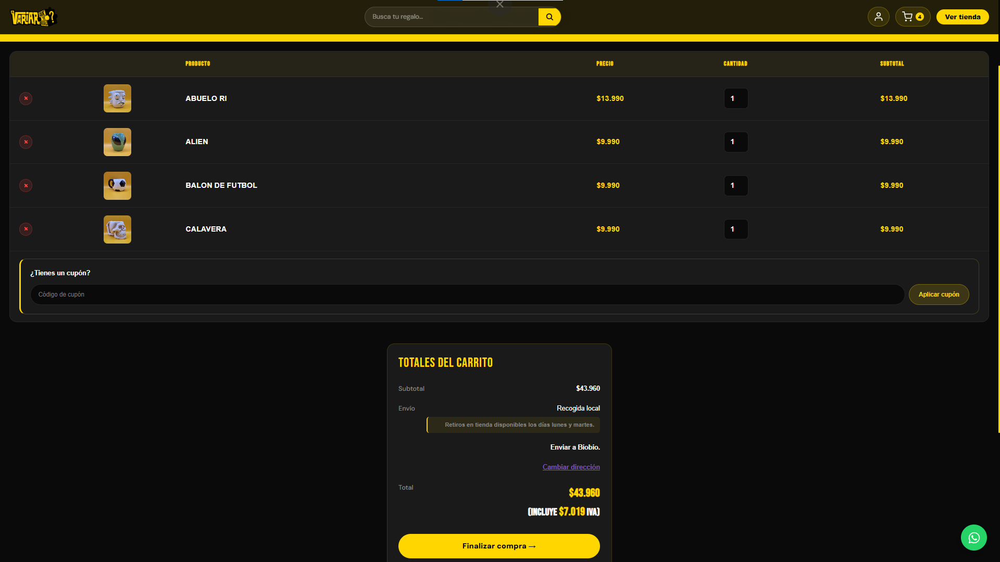
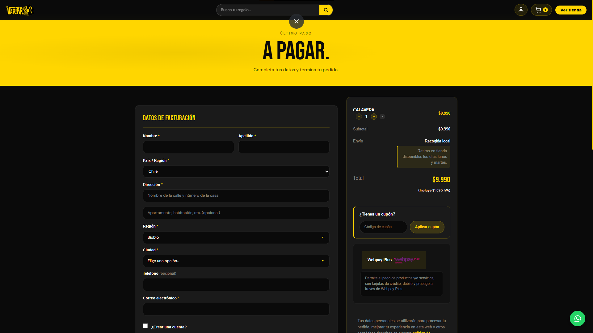

# PaVariar — E-commerce de regalos

**PaVariar** es una tienda online de regalos en Chile. Este repositorio documenta el proyecto completo que desarrollé como freelance: un tema de WordPress a medida con una experiencia de compra completa, de principio a fin.

> 📸 Este es un repositorio de **documentación y capturas**, no de código fuente. Es un proyecto comercial en producción, propiedad del cliente, por lo que el código no es público. Lo que encontrarás aquí es un registro honesto del alcance técnico del trabajo.

---

## Mi rol

Desarrollo freelance full-stack del proyecto completo: arquitectura, implementación y puesta en producción. Trabajé directamente con el cliente de principio a fin — desde la estructura del tema hasta la integración de pagos y despachos.

## Stack técnico

| Capa | Tecnología |
|---|---|
| CMS / E-commerce | WordPress + WooCommerce |
| Tema | Child theme custom sobre Storefront (paleta negro/amarillo, tipografías Bebas Neue + DM Sans) |
| Backend custom | PHP (módulos propios del tema) |
| Pagos | Webpay Plus (Transbank) |
| Despacho | Blue Express (integración de cotización y emisión de etiquetas) |
| Infraestructura | Hosting compartido (cPanel/CWP), WP Mail SMTP, DNS con SPF/DKIM/DMARC |

## El proyecto

Un e-commerce completo construido sobre un tema hijo de WordPress hecho a medida — no una plantilla genérica. Cubre toda la experiencia de compra: home, catálogo con filtros y búsqueda, ficha de producto con galería tipo carrusel, carrito, checkout en dos columnas con resumen fijo, cuenta de usuario, y un flujo de pago y despacho completo con Webpay y Blue Express.

Ver el detalle completo en [`docs/funcionalidades.md`](docs/funcionalidades.md).

> La tienda se administra y gestiona con **[POS-multisede](https://github.com/gescalonaw/POS-multisede)**, un plugin de inventario y punto de venta que también desarrollé, documentado como proyecto aparte.

## Capturas

| | |
|---|---|
|  |  |
| Página de inicio | Categorías destacadas |
|  |  |
| Preguntas frecuentes | Reseñas de clientes |
|  |  |
| Carrito de compras | Checkout en dos columnas |

## Enlaces

- 🔗 **Sitio en producción:** [pavariar.cl](https://pavariar.cl)
- 📄 **Detalle técnico completo:** [docs/funcionalidades.md](docs/funcionalidades.md)

### Desarrollado por

**Gabriela Escalona** — [LinkedIn](https://linkedin.com/in/gabriela-escalona-weldt-b32855243) · [Portafolio](https://github.com/gescalonaw)

**Miko Peñailillo** — [LinkedIn](https://www.linkedin.com/in/mirko-peñailillo-vásquez-70094339b) · [Portafolio](https://github.com/MirkoVP)
